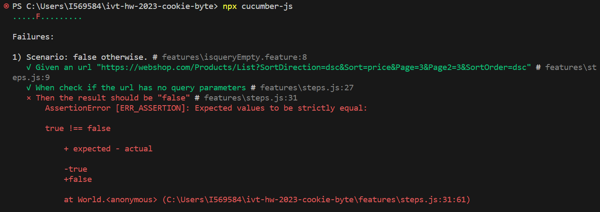
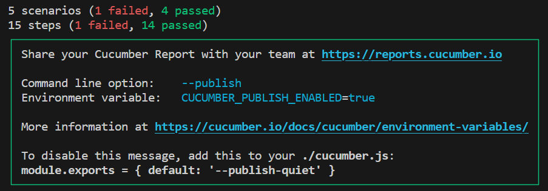

# BDD Tests using Cucumber Overview
For the BDD workflow, we created a feature folder that has multible feature files that outlines various scenarios, describing the expected behavior of the library function under different conditions. Each scenario consists of given, when, and then steps, which map to the preconditions, actions, and expected outcomes of the test case. These steps are implemented using step definitions in the steps.js file, where you can write the necessary code to interact with the library function and perform assertions.

We created 4 diffrent feature files the "isqueryEmpty" file has 2 scenarios, the first one tests if the passed url has a query parameters and as I passed url without query parameters it returned true and pass the test as expected. The other one has a query parameters but it retured true although we expected it to return false so it didn't pass the test. Check the screenshot!

the other 3 feature files one of them tests the toString() method, another one tests the queryLength(), an another tests the isEmptyQuery() methods and all of them act as expected and passed the tests. Ceck the final report!

# Lessons learned

BDD (Behavior-Driven Development) tests using Cucumber are an effective way to ensure the functionality and behavior of the domurl library functions.

By using Cucumber, you can define test scenarios in a natural language format that closely resembles the language of the business or technical requirements. This approach promotes collaboration among team members, provides a reliable foundation for validating the correctness and functionality of your code, and make it easier to contribute to the tests specifications.