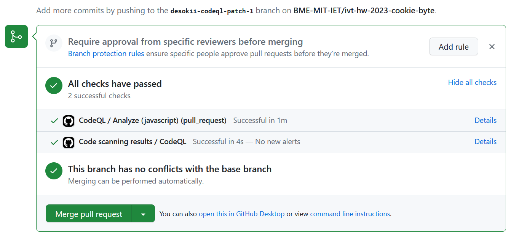
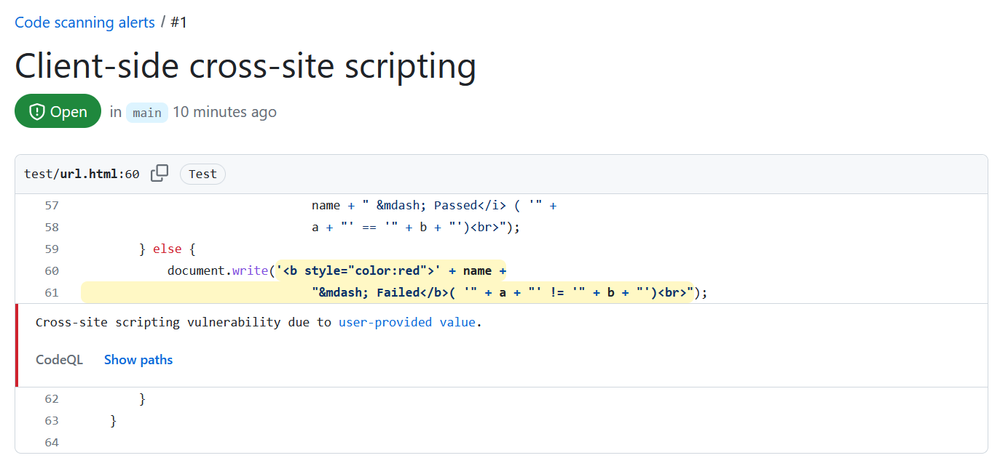

## CodeQL
CodeQL is a powerful static analysis tool developed by GitHub developers. 
Its main usage is to perform code analysis and identify potential security vulnerabilities, bugs, 
and code quality issues in big software projects or even a small ones. CodeQL allows developers to write queries 
to analyze codebases and detect various types of issues, including security vulnerabilities, data leaks, code smells, and more.

CodeQL is different from the traditional static analysis technologies as it will investigate semantically whereas the common ways adopt syntactic approaches (i.e. AST) [[1](#1)].

# Workflow

The following screenshot is the result of analyzing the JavaScript code. There are no integration-related errors.

# Security risks

The below screenshot is taken on the "Security" tab of GitHub. One vulnerability (XSS) is detected during analysis so we created an issue for it.

## References:
<a id="1">[1]</a>
CodeQL. (n.d.). Retrieved May 16, 2023, from https://codeql.github.com/
