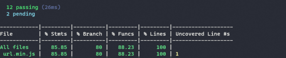
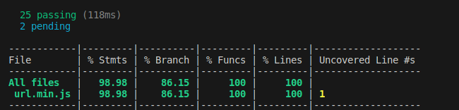

# Test Coverage

Istanbul instruments JavaScript code with line counters, so that we can track how well our unit-tests exercise the code.

Istanbul runs with Mocha. After installing it, *nyc* command should be added to the test script command.

# Pre- and Post- Coverages

Before extending the unit tests:

After:

