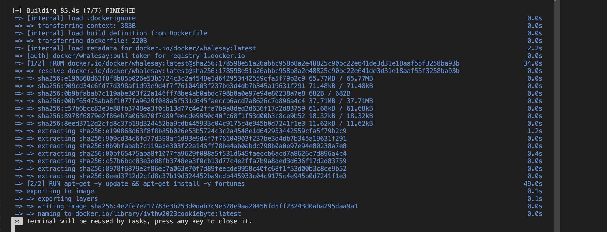
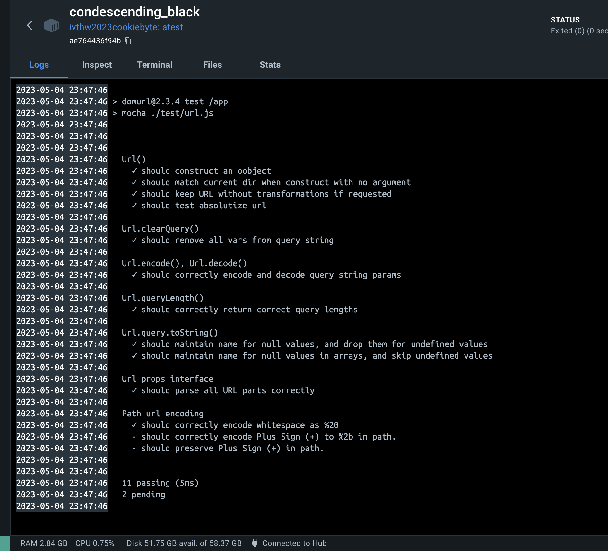

# Docker
In general, Docker simplifies the tasks of building, running, managing, and distributing applications by creating images of the project. Typically, Docker facilitates faster software deployment using contatiners, but in the case of a library like ours, it may not be necessary. However, it is considered a good practice to dockerize the application.

#Tests

Running tests on the project using Docker test, By running the shell code included in the project docker automatically creates the image and run its container.

Test cases are defined as assertion statements in test/url. Results recieved with 11 passing tests, which proof of 2 pending need to be checked.

