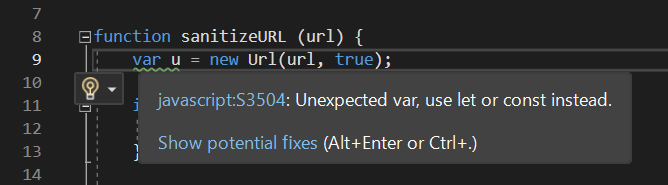
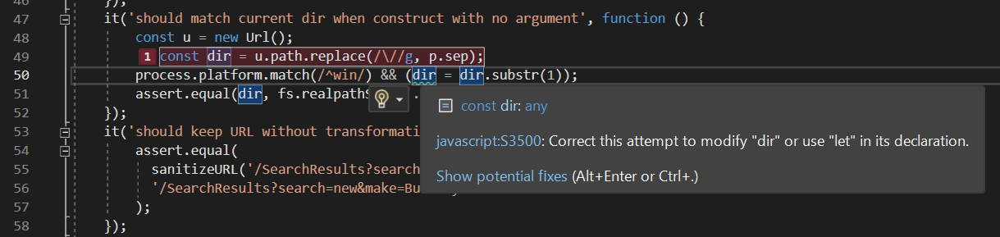
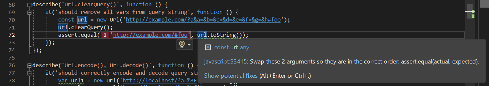
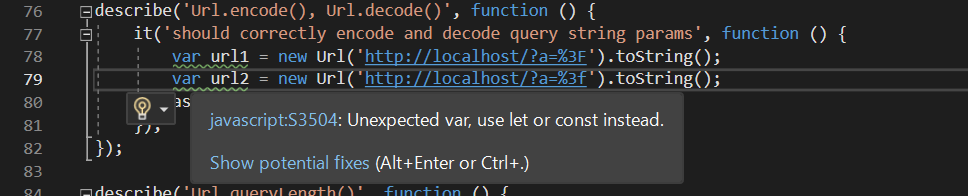

## SonarQube

We used static one of analysis technologies, SonarQube/SonarLint [[1]](#1).

5 warnings are found from the given text (url.js) as follows:

First photo refers:
It is recommended to use let if we will not use the variable anymore or change it later in our project.

Second photo refers:
User attempts to substitute a value to const while it shall not be modified.

Third photo refers:
The order of parameters shall be in the correct order (var, const) or (actual, expected). 

Fourth photo refers:
Analogous to the above.

## References:
<a id="1">[1]</a> 
SonarQube 10.0. (n.d.-b). SonarQube Documentation. Retrieved May 4, 2023, from https://docs.sonarqube.org/latest/
